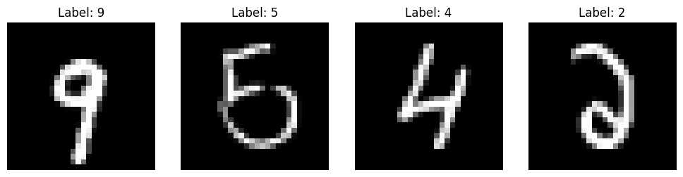
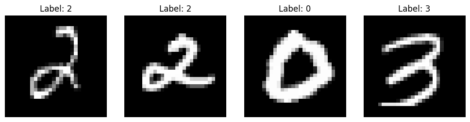
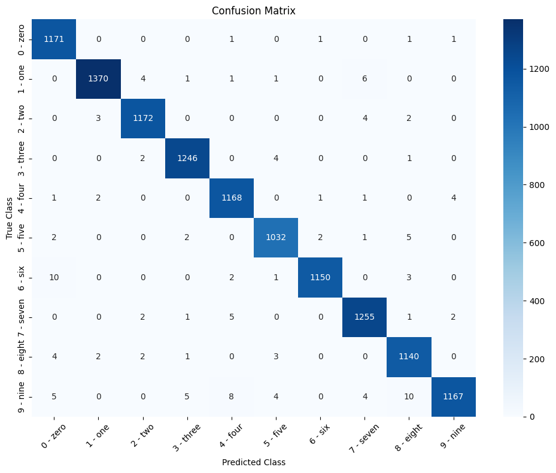

# Handwritten Digit Recognition using MNIST Dataset

This project demonstrates a machine learning model for recognizing handwritten digits using the MNIST dataset. The model is trained using deep learning techniques, achieving good accuracy on classifying digits from 0 to 9.

## Dataset

The MNIST dataset consists of 28x28 pixel grayscale images of handwritten digits. It contains 60,000 training images and 10,000 test images, each corresponding to one of the 10 digit classes.

You can access the MNIST dataset [here](http://yann.lecun.com/exdb/mnist/).

## Model

The model used in this project is a Convolutional Neural Network (CNN), which is particularly effective for image classification tasks.

## Results

The model achieves an accuracy of approximately XX% on the test set. The following are some visualizations of the model's performance:

### Dataset Images

Below are a few samples of the handwritten digits from the MNIST dataset:

### Confusion Matrix

The confusion matrix below shows the performance of the model on the test dataset:

